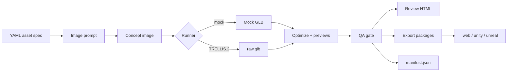

# 3D Asset Factory

CLI-first pipeline for generating, checking, reviewing, and packaging 3D assets from
checked-in YAML specs.

[](https://x.com/HowToAI_/status/2056387308287676819)

Click the GIF to open the original X post.

## What It Does

3D Asset Factory turns a structured asset spec into a reproducible run directory:

- Generates a concept image prompt and concept image.
- Runs a 3D generator through a runner interface.
- Optimizes the resulting GLB.
- Runs deterministic QA checks.
- Creates a browser review page.
- Packages exports for web, Unity, and Unreal.
- Writes manifest/provenance metadata for every run.



The mock runner works on a laptop and is useful for validating the pipeline. Real TRELLIS.2
inference requires a Linux NVIDIA GPU machine.

## Quick Setup

Clone and install:

```bash
git clone https://github.com/PSkinnerTech/3d-asset-factory.git
cd 3d-asset-factory
python -m pip install -e ".[dev]"
```

Run checks:

```bash
python -m ruff check .
python -m pytest -q
```

Generate a local mock asset:

```bash
python -m asset_factory generate assets/seeds/chloroplast_conceptual.yaml --runner mock
```

Open the review page:

```bash
python -m asset_factory review runs/chloroplast_001/<timestamp>
```

Inspect the manifest:

```bash
python -m json.tool runs/chloroplast_001/<timestamp>/manifest.json | head -120
```

## Specs

Specs live in `assets/seeds`. Each spec declares the object, style, QA thresholds, and export
profiles:

```yaml
id: chloroplast_001
subject: biology
object: chloroplast
grade_band: "6-8"
style: conceptual
learning_goal: Identify the outer membrane, stroma, thylakoids, and grana.
exports: ["web", "unity", "unreal"]
qa:
  max_triangles: 150000
  max_glb_mb: 25
```

## Output Layout

A generated run looks like this:

```text
runs/<asset_id>/<timestamp>/
  image/concept.png
  image/prompt.txt
  trellis/raw.glb
  trellis/raw_report.json
  optimize/asset.glb
  previews/thumbnail.png
  previews/turntable.webm
  reports/qa.json
  reports/review.html
  exports/web/
  exports/unity/
  exports/unreal/
  manifest.json
```

Export packages contain package-local manifests, so `exports/web/manifest.json` points to
`asset.glb`, `thumbnail.png`, `turntable.webm`, and `qa.json` inside that package.

## TRELLIS.2 Inference

The pipeline talks to real TRELLIS.2 through `TRELLIS2_COMMAND`.

`TRELLIS2_COMMAND` is a command template. The pipeline replaces:

- `{image}` with the generated concept image path.
- `{output}` with the runner output directory.
- `{resolution}` with the requested resolution.

The command must create:

```text
{output}/raw.glb
```

### Local GPU Machine

Use this path when you are already on a Linux NVIDIA GPU host.

Prerequisites:

- Linux.
- NVIDIA GPU with 24GB+ VRAM.
- CUDA Toolkit, ideally 12.4.
- Conda.
- TRELLIS.2 installed with model weights available.
- `OPENAI_API_KEY` set.

Example run:

```bash
export OPENAI_API_KEY="sk-your-development-key"
export TRELLIS2_COMMAND='conda run -n trellis2 python /opt/trellis2/trellis_generate.py {image} {output}'

python -m asset_factory generate assets/seeds/chloroplast_conceptual.yaml --runner trellis
```

The wrapper at `/opt/trellis2/trellis_generate.py` is responsible for loading TRELLIS.2, reading
the image path argument, and writing `{output}/raw.glb`.

### SSH Remote Runner

This is the quickest path when your laptop is the controller and a GPU box runs TRELLIS.2.

```text
laptop
  generate concept image
  scp image to GPU host
  ssh GPU host to run TRELLIS.2
  scp raw.glb back
  continue QA, review, and exports locally
```

Set `TRELLIS2_COMMAND` to a wrapper script:

```bash
export OPENAI_API_KEY="sk-your-development-key"
export TRELLIS2_COMMAND='python scripts/remote_trellis_runner.py {image} {output}'

python -m asset_factory generate assets/seeds/chloroplast_conceptual.yaml --runner trellis
```

The wrapper should copy `{image}` to the GPU host, run TRELLIS.2 there, and copy the remote
`raw.glb` back to `{output}/raw.glb`.

### Remote Runner API

For a production setup, use a GPU service instead of SSH. A future remote runner should submit the
concept image to an API and receive a GLB plus structured logs.

Suggested request:

```http
POST /v1/generate
Content-Type: multipart/form-data

image=@concept.png
resolution=1024
asset_id=chloroplast_001
```

Suggested response:

```json
{
  "job_id": "01j...",
  "status": "succeeded",
  "runner_type": "trellis-remote",
  "runner_version": "trellis2-4b",
  "raw_glb_url": "https://...",
  "metrics": {
    "duration_seconds": 17.2,
    "gpu": "NVIDIA H100"
  }
}
```

The API path is better for queues, retries, authentication, audit logs, and shared team usage.

## Commands

```bash
python -m asset_factory generate assets/seeds/chloroplast_conceptual.yaml --runner mock
python -m asset_factory qa runs/chloroplast_001/<timestamp>
python -m asset_factory export runs/chloroplast_001/<timestamp> --profile web
python -m asset_factory review runs/chloroplast_001/<timestamp>
```
